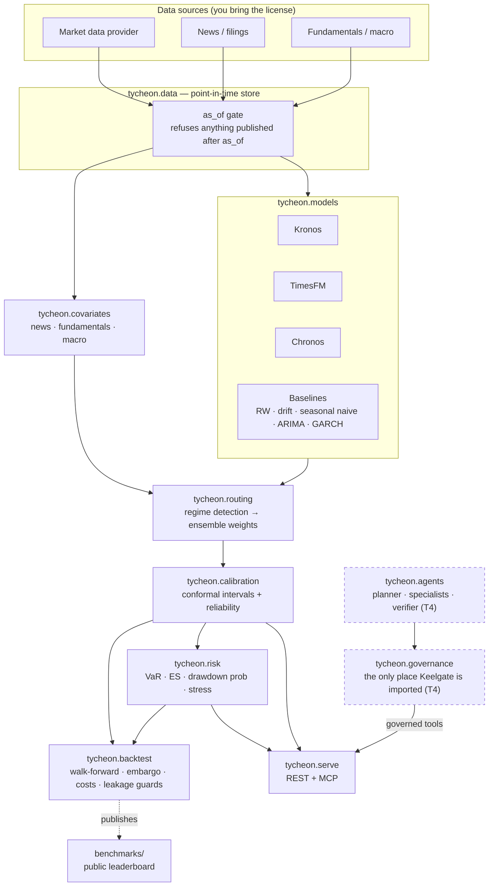

# Tycheon

**Kronos forecasts the path; Tycheon tells you how much to trust it.**

Tycheon is the open-source calibrated forecasting and risk layer for financial
time series. Foundation models for time series will happily hand you a
trajectory with no honest statement of its uncertainty, no check that its
intervals hold up out of sample, and no translation into the numbers a risk
desk actually uses. Tycheon is that missing layer.

[](LICENSE)
[](pyproject.toml)

> **Status: Phase T0 — bootstrap.** The layout, tooling and gates are in place;
> the modules are declared and empty. Nothing here forecasts anything yet.

## What it does

| Capability | What that means |
|---|---|
| **Calibrated uncertainty** | Conformal prediction intervals with reliability diagnostics, so 90% coverage means 90% coverage. |
| **Exogenous covariates** | News, fundamentals and macro features — not OHLCV alone. |
| **Multi-model routing** | Kronos, TimesFM, Chronos and honest baselines, weighted by detected regime. |
| **Forecast-to-risk** | VaR, Expected Shortfall, drawdown probability, stress scenarios, portfolio aggregation. |
| **Leakage-proof evaluation** | Walk-forward backtesting with embargoes, a cost model, and a public leaderboard. |
| **Production serving** | REST and MCP, plus a governed agentic research workflow. |

Tycheon is B2B risk-analytics infrastructure for developers and fintechs. It is
**not** a consumer trade-signal product and it does **not** give personalized
investment advice.

## Architecture



Every forecast that leaves this system carries its intervals, its calibration
status, the model mix that produced it, its `as_of`, and a model card
reference. Every evaluation reports the random-walk baseline and a
Diebold-Mariano test — including when the baseline wins.

## Quickstart

Requires [uv](https://docs.astral.sh/uv/) and Python 3.11+.

```bash
git clone https://github.com/anilatambharii/tycheon.git
cd tycheon
make setup          # create the venv, install dev deps and git hooks
make check          # lint, format check, mypy --strict, fast tests
python -c "import tycheon; print(tycheon.__version__)"
```

Optional dev services (Postgres, Redis, MinIO, Jaeger):

```bash
cp .env.example .env
make up             # start and wait for health
make down           # stop and delete volumes
```

The foundation models are optional extras, so the base install stays small:

```bash
uv sync --extra kronos      # Kronos + torch
uv sync --extra timesfm
uv sync --extra chronos
uv sync --extra serve       # FastAPI + MCP server
uv sync --all-extras        # everything
```

Validate the smoke benchmark config:

```bash
make benchmark-small
```

> **No `make` on Windows?** Every target is a one-line `uv` command; open the
> [`Makefile`](Makefile) and run them directly, e.g. `uv sync` then
> `uv run ruff check . && uv run mypy && uv run pytest -m "not slow"`.

## Project layout

```
src/tycheon/
  data/          provider protocol, as-of store, sample data
  models/        kronos, timesfm, chronos, baselines
  calibration/   conformal intervals, diagnostics
  covariates/    news, fundamentals, macro features
  routing/       regime detection, ensemble weighting
  risk/          VaR, ES, drawdown prob, stress, portfolio aggregation
  backtest/      walk-forward, metrics, cost model, leakage guards
  governance/    the only place Keelgate is imported (from T4)
  agents/        planner, specialists, verifier (from T4)
  serve/         FastAPI + MCP server
benchmarks/      leaderboard harness, configs, results
docs/            methodology, ADRs, model cards
ee/              proprietary Tycheon Cloud — separate license
```

## Safety and data rules

These are not aspirations; they are enforced in tests and CI.

- **Point-in-time everything.** Every data read takes an `as_of` and refuses
  data published after it. Leakage tests are mandatory for every data path.
- **No live execution.** v1 is paper and simulation only, and only through
  Keelgate-governed tools.
- **Uncertainty is not optional.** No forecast ships without intervals,
  calibration status, model mix, `as_of` and a model card.
- **Honest baselines.** Random walk plus Diebold-Mariano on every evaluation,
  published whichever way it goes.
- **External text is data, never instructions.** News and filings are untrusted
  input; nothing in them is ever executed.
- **Your data licence stays yours.** Providers are pluggable, customers bring
  their own market-data licence, and Tycheon never redistributes licensed
  exchange data. `yfinance` appears in examples and local dev only, clearly
  labelled, never in the cloud product.

More in [`docs/safety.md`](docs/safety.md) and [`SECURITY.md`](SECURITY.md).

## Sister project

[Keelgate](https://github.com/anilatambharii/keelgate) is the safety harness —
policy gates, capabilities, approvals, audit, durable loops, telemetry and
evals. Tycheon depends on it as a library from Phase T4, and every Keelgate
import is confined to
[`src/tycheon/governance/`](src/tycheon/governance/README.md).

## Open core

Everything outside `ee/` is Apache-2.0. `ee/` is Tycheon Cloud and carries its
own proprietary licence. The boundary and the rules for it are in
[`docs/adr/0001-licensing-and-open-core.md`](docs/adr/0001-licensing-and-open-core.md).

Kronos is used under its upstream MIT licence
([shiyu-coder/Kronos](https://github.com/shiyu-coder/Kronos)); its notice is
retained wherever its code is vendored.

## Contributing

See [`CONTRIBUTING.md`](CONTRIBUTING.md) and
[`CODE_OF_CONDUCT.md`](CODE_OF_CONDUCT.md). `make check` must pass, tests ship
with code, and no PR lands without them.

---

**For research and risk analytics. Not investment advice.** Nothing produced by
this software is a recommendation to buy or sell any security, and no part of it
is personalized financial advice. Past calibration does not guarantee future
coverage.
