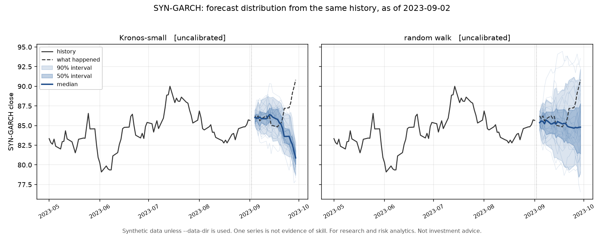

# Tycheon

**Kronos forecasts the path; Tycheon tells you how much to trust it.**

Tycheon is the open-source calibrated forecasting and risk layer for financial
time series: conformal prediction intervals you can check, exogenous covariates
beyond OHLCV, regime-weighted routing across Kronos, TimesFM, Chronos and
honest baselines, translation of forecasts into VaR, Expected Shortfall and
drawdown probabilities, and leakage-proof walk-forward evaluation with a public
leaderboard.

!!! warning "Phase T1 - foundations"
    Point-in-time data, five baselines and Kronos / TimesFM / Chronos behind one
    forecaster contract are built. Every forecast is **uncalibrated**: calibration,
    the risk layer and leakage-proof evaluation are the next phases, so nothing here
    yet says how much to trust a forecast.



## Start here

| Page | What is in it |
|---|---|
| [Methodology](methodology.md) | How calibration, routing, risk translation and evaluation are meant to work, and what we refuse to claim. |
| [Safety and compliance](safety.md) | Point-in-time discipline, no live execution, untrusted external text, data licensing. |
| [Model cards](models/index.md) | One card per forecaster: source, licence, training data, limitations, calibration status. |
| [ADR 0001](adr/0001-licensing-and-open-core.md) | Why Apache-2.0 plus a proprietary `ee/`, and where the line sits. |
| [ADR 0002](adr/0002-kronos-integration.md) | Why Kronos is vendored, and why its sampler is replaced. |
| [ADR 0003](adr/0003-point-in-time-data-and-forecast-contract.md) | The two-clock data model and the forecast contract. |

## Install

```bash
pip install tycheon                  # core: baselines, calibration, risk, backtest
pip install "tycheon[kronos]"        # Kronos + torch
pip install "tycheon[timesfm]"       # TimesFM
pip install "tycheon[chronos]"       # Chronos
pip install "tycheon[serve]"         # FastAPI + MCP server
```

Development setup, the dev stack and the contribution gate are in
[`CONTRIBUTING.md`](https://github.com/anilatambharii/tycheon/blob/main/CONTRIBUTING.md).

## The three invariants

Everything in this project follows from these.

1. **Point-in-time.** Every data read takes an `as_of` and refuses anything
   published after it. Leakage tests are mandatory for every data path.
2. **Uncertainty is not optional.** Every forecast carries intervals or
   quantiles, calibration status, the model mix that produced it, its `as_of`
   and a model card reference.
3. **Honest baselines.** Every evaluation reports the random-walk baseline and
   a Diebold-Mariano test, published whichever way the result goes.

## What Tycheon is not

- Not a consumer trade-signal product.
- Not personalized investment advice.
- Not a market-data vendor. Providers are pluggable and you bring your own data
  licence; Tycheon never redistributes licensed exchange data.
- Not a live execution system. v1 is paper and simulation only, and only
  through [Keelgate](https://github.com/anilatambharii/keelgate)-governed tools.

---

For research and risk analytics. **Not investment advice.** Nothing produced by
this software is a recommendation to buy or sell any security. Past calibration
does not guarantee future coverage.
